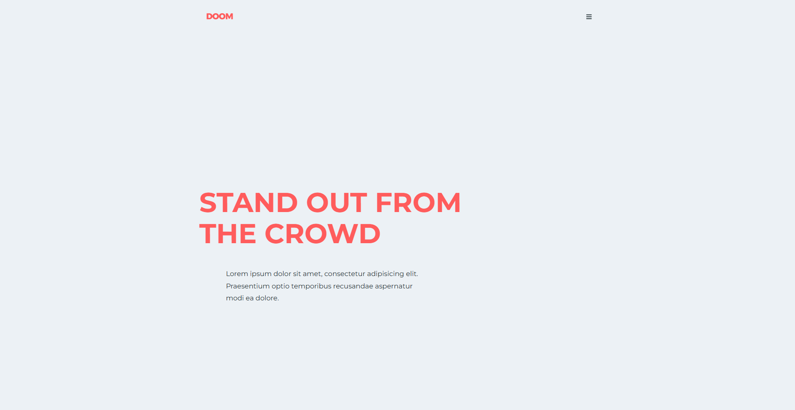

# Modern Landing Layout

A recreation of the **Doom - Minimal Agency Template** from Graphberry.com, built with **HTML** and **CSS**.  
This project was created as a learning exercise to practice **modern CSS layout techniques**, including **Flexbox** and **CSS Grid**.

---

## 🌐 Live Demo
[View on GitHub Pages](https://ibrahim-rezq.github.io/modern-landing-layout/)

---

## 🖼️ Preview


---

## 🎯 Purpose
This project was developed to practice:
- Building **pixel-perfect layouts** from design templates
- Implementing **responsive design** for multiple screen sizes
- Mastering **Flexbox** and **CSS Grid** layout systems
- Writing **semantic HTML5** markup
- Organizing **clean, maintainable CSS code**

The template features a minimal, modern design perfect for creative agencies and portfolios.

---

## 💡 Learning Takeaways
Through this project, I learned to:
- Structure complex layouts using **CSS Grid** and **Flexbox**
- Implement **responsive design patterns** for mobile and desktop
- Use **CSS custom properties** for maintainable styling
- Organize CSS code with better structure and readability
- Translate design mockups into functional web pages

---

## 🧩 Technologies Used
- **HTML5** (Semantic markup)
- **CSS3** (Flexbox, Grid, Custom Properties)

---

## 🚀 Getting Started

1. Clone the repository:
   ```bash
   git clone https://github.com/Ibrahim-Rezq/modern-landing-layout.git
   ```

2. Open the project folder and launch `index.html` in your browser.

That's all — it's a fully static project, ready to view or customize.

---

## ⚙️ Customization

Feel free to modify this template:

* Update content and images to match your brand
* Adjust colors using CSS custom properties
* Modify layout breakpoints for different responsive behaviors
* Add additional sections or components as needed

---

## 📸 Design Credits

Original design by [Graphberry](https://www.graphberry.com/) - Doom Minimal Agency Template

---

## ⚖️ License

This project is shared under the **MIT License** — you are free to use, modify, and distribute it for personal or commercial projects.

---

## 👨‍💻 Author

Created by [Ibrahim Rezq](https://github.com/Ibrahim-Rezq) as part of a front-end learning journey.
